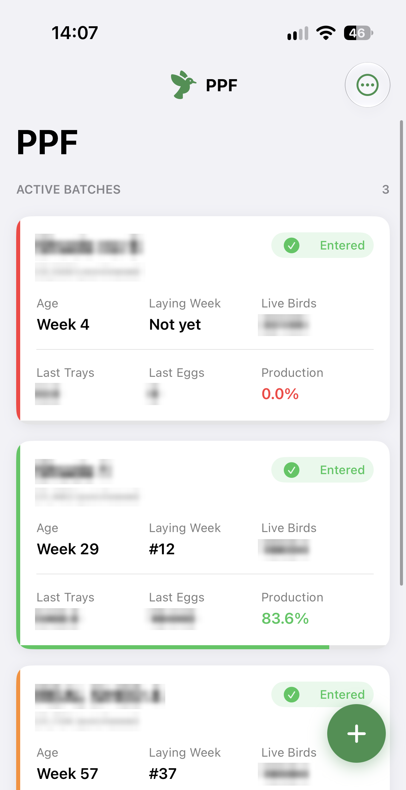
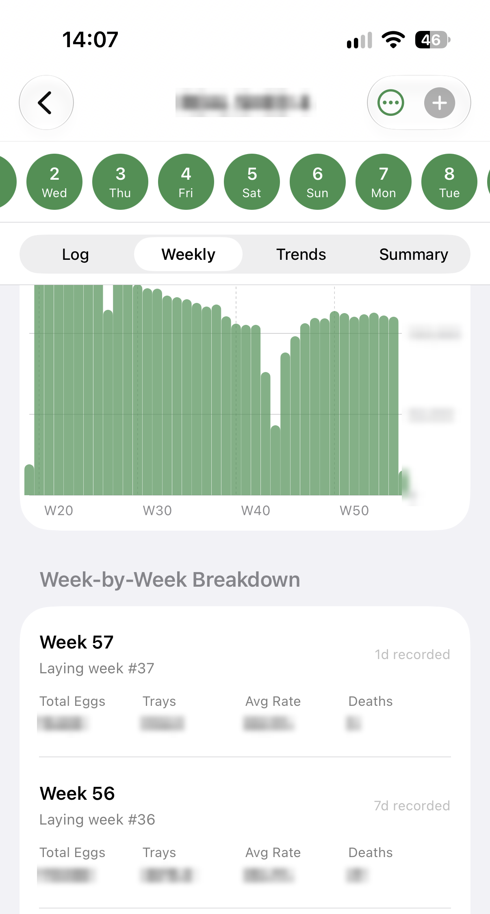
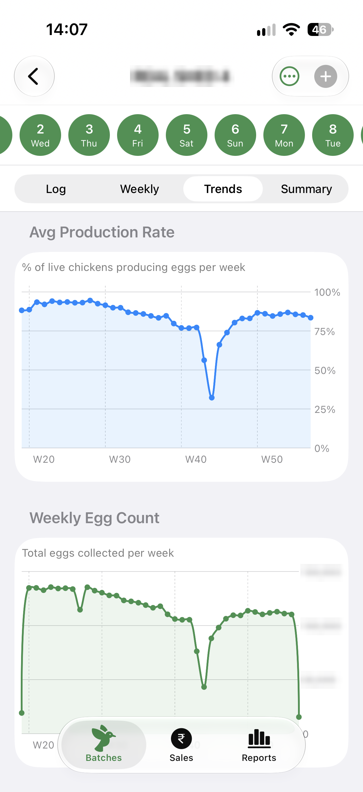

# Poultry Farm Tracker (iOS)

A native iOS app I designed and built to run the daily operations of a family poultry farm: many flocks ("batches") of different ages running at the same time, with records entered daily by more than one person on more than one device.

> **Showcase repo.** The app's source code is private. This repo includes the architecture, the product approach and a few representative source files.

## Screenshots
<p>
  
  
  
</p>

<sub>Production figures are blurred.</sub>

## The problem
Daily production and mortality data was tracked by hand, one batch at a time. That made it hard to see weekly trends, compare batches, or know whether today's entry had been made.

## What the app does
- **Batch dashboard:** one card per active batch, showing age in weeks, laying week, today's entry status and yesterday's production rate. Cards can be reordered by dragging.
- **Daily entry and editing:** chicken count, deaths, eggs and trays (derived from the egg count), with handling for different time zones.
- **Batch detail:** a daily log, weekly summaries, trend charts (Swift Charts) and cumulative "to date" statistics (production rate, mortality ratio, eggs per bird).
- **Farm reports:** charts that compare all batches.
- **Sales:** bills with revenue tracking and a PDF preview.
- **Archive:** ended batches become read-only, with all their data kept.
- **Login:** Firebase Authentication. Firestore security rules block any read or write without a signed-in user.

## Architecture
```
SwiftUI Views ──► ViewModels (ObservableObject, async/await)
                        │
                        ▼
               Services (FirestoreService, AuthService)
                        │
                        ▼
          Firebase Firestore (real-time sync) + Firebase Auth
```
- **MVVM:** views hold no business logic. Metrics that need the full record history (running chicken count, production rate, weekly totals) are calculated in `BatchAnalytics` rather than stored.
- **Sorting on the device:** results are sorted in the app, which avoids needing a composite Firestore index (see `FirestoreService`).
- **Stack:** Swift, SwiftUI, Swift Charts, Firebase Firestore, Firebase Auth, XcodeGen (`project.yml`), TestFlight.

## How it was built
- **PRD first:** I wrote a product requirements document with a feature registry and planned versions (v1 core tracking, v2 usability, v3 sales). Features are added one at a time from that backlog.
- **AI-assisted development:** I used Claude Code for implementation while I owned the product decisions and design.
- **Releases:** shipped through TestFlight to the people who use it daily. The current build is v1.2.

## Files in this repo
| File | What it shows |
|---|---|
| [`code/BatchAnalytics.swift`](code/BatchAnalytics.swift) | Domain model for derived metrics: weekly aggregates and cumulative stats |
| [`code/FirestoreService.swift`](code/FirestoreService.swift) | Data access layer: async Firestore queries, Codable mapping, error handling |
| [`code/TrendGraphsView.swift`](code/TrendGraphsView.swift) | Swift Charts trend views |

## Roadmap
Cost and profit/loss tracking, feed and water logging, a health and medication log, daily entry reminders, and PDF/Excel export.
